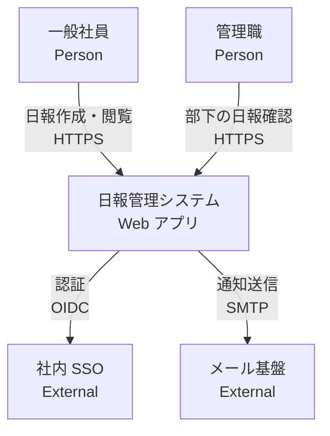
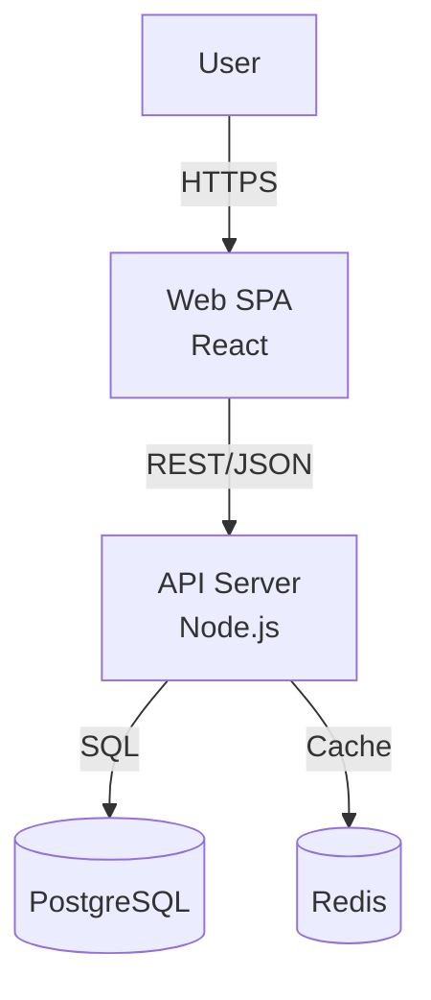
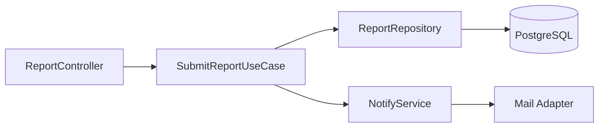

# アーキテクチャ図出力スキーマ

## 目的

C4 モデル（Context / Container / Component）に準拠したアーキテクチャ図を生成し、システムの構造をドキュメント化する。

## 入力ソース

- SRS（Epic / Feature）
- 技術制約（`context-repo/requirements/non-functional-requirements.md`）
- ADR（既存の技術選定）

## 必須レベル（3 層）

| レベル | 対象読者 | 内容 |
|---|---|---|
| **Level 1: System Context** | 経営層・非技術者 | システムと外部アクター・外部システムの関係 |
| **Level 2: Container** | アーキテクト・開発者 | デプロイ単位（アプリ / DB / キャッシュ / キューなど）と通信 |
| **Level 3: Component** | 開発者 | Container 内部の主要コンポーネントと責務 |

## 記法

- **Mermaid** を標準とする（GitHub / 多くのツールでレンダリング可能）
- 代替: PlantUML, Structurizr DSL

## 必須項目

各図は以下を持つ：

| 項目 | 内容 |
|---|---|
| 図タイトル | 例: `Level 1: 日報管理システム — System Context` |
| 凡例 | ノード種別と矢印の意味 |
| 要素ラベル | 名前 + 技術スタック（Container 以降） |
| 依存関係の明示 | 矢印には通信プロトコル・目的を記す |
| 関連 ADR | 重要な設計判断への参照 |

## 品質基準

- [ ] 3 レベル（Context / Container / Component）すべてが存在する
- [ ] 各図に凡例がある
- [ ] Container レベル以降ではノードに技術スタックが明記されている
- [ ] 矢印には通信の方向・プロトコル・目的が記されている
- [ ] 外部システムは内部と視覚的に区別されている
- [ ] 1 つの図に要素が **15 個以内**（複雑な場合は分割）

## トレーサビリティ

- **上流**: SRS の Epic、非機能要件、ADR
- **下流**: 実装コードの構造（ディレクトリ / モジュール）、DB スキーマ、OpenAPI

## 出力例

### Level 1: System Context

### Level 2: Container

### Level 3: Component（例: API Server 内部）

