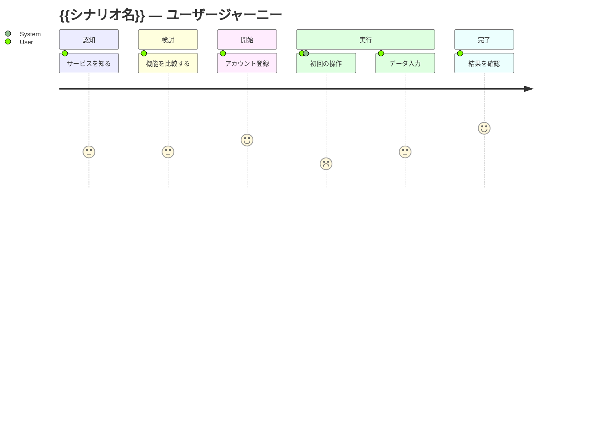

# User Journey: {{シナリオ名}}

> ファイル名規則: `user-journey-<シナリオ>.md`（例: `user-journey-onboarding.md`）
> AI はこれを読んで **網羅的な** UserStory を生成します。ステージを飛ばさず、負の感情が発生する瞬間も記録してください。

## 基本情報

- **ID**: `journey-<シナリオ>`
- **ペルソナ**: `persona-primary-user`
- **シナリオ概要**: {{どんな状況で、何を達成しようとするか}}
- **想定頻度**: 毎日 / 週次 / 月次 / 単発

## ジャーニーマップ

| ステージ | 行動 | 思考 | 感情 | タッチポイント | 課題 |
|---|---|---|---|---|---|
| 1. 認知 | {{ユーザーが行うこと}} | {{内心の声}} | 😐 / 😊 / 😣 | {{触れる媒体・UI}} | {{躓くポイント}} |
| 2. 検討 | | | | | |
| 3. 開始 | | | | | |
| 4. 実行 | | | | | |
| 5. 完了 | | | | | |
| 6. 振り返り | | | | | |

## 図（Mermaid）

## キーモーメント

> 特にユーザー体験を左右する瞬間（Make or Break Moment）

1. **{{モーメント名}}**: {{なぜ重要か}}
2. **{{モーメント名}}**: {{...}}

## 改善のヒント（仕様への示唆）

- {{この課題を解決する仕様アイデア}}
- {{新しい機能 / 既存機能の改善案}}

## 関連

- 関連ペルソナ: `personas/persona-primary-user.md`
- 関連インタビュー: `interviews/YYYY-MM-DD_xxx.md`
- 関連調査: `research/yyy.md`
