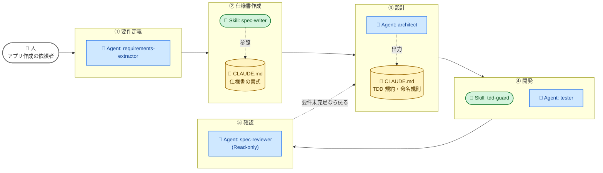

# 自宅課題（Day1 → Day2 / 目安 30〜40 分）

| 項目 | 内容 |
|---|---|
| **タイミング** | Day1 終了後〜Day2 開始まで |
| **目安時間** | **30〜40 分** |
| **提出** | **不要**（Day2 冒頭で発表してもらいます） |
| **目的** | Day1 で学んだ語彙（Skill / Sub-agent / MCP / CLAUDE.md）を、開発の **5 工程** にどう組み込むか自分の言葉で設計する。**この課題は Day2 体験③ の実装題材になります** — 講師が冒頭発表の中から 1 案を選び、**その場で全員でハーネス化** します（Hook は Day2 で扱うため、自宅課題では任意） |

---

## 課題：日報アプリで 5 工程の AI ハーネスを設計する

体験② で作った **日報アプリ** を題材に、要件定義から動くものを確認するまでの **基本 5 工程** を AI ハーネスでどう支えるか、構成案を考えてください。

```
① 要件定義 ─→ ② 仕様書作成 ─→ ③ 設計 ─→ ④ 開発 ─→ ⑤ 確認
```

**提出は不要**ですが、**Day2 冒頭で 3–4 人ずつ持ち寄って 5 分発表** してもらいます。当日 Markdown を画面共有 / 印刷で見せられる状態にしてきてください。

> 全工程を AI 任せにしたいわけではありません。**「どこに / 何を / なぜ置くか」** を言語化することが目的です。

---

## お題

### 1. 5 工程それぞれで「やってもらう具体的な行為」

| 工程 | 受講生（の AI ハーネス）にやってもらう具体的な行為 |
|---|---|
| **① 要件定義** | アプリ作成の **依頼者へのヒアリング** を AI に行わせ、「何を記録したいか / どう振り返りたいか / どんな画面が欲しいか」など要件を引き出す |
| **② 仕様書作成** | ① で引き出した要件を **仕様書テンプレに沿って自動で書く**（受入条件・画面定義・データモデル）。つまり ① で AI が利用者から十分な情報を引き出せている必要がある |
| **③ 設計** | アーキテクチャ / 作成するコンポーネント / **開発ルール（TDD ＝ テスト先行 + 仕様適合チェック をここで規約化）** |
| **④ 開発** | テストと実装。③ で決めた TDD 規約に沿って動かす |
| **⑤ 確認** | ② の要件（受入条件）が満たされているかの確認（テスト実行 + 受入条件レビュー） |

> **③ に TDD を入れ込んだ理由**: 「ルール（規約）を立てる工程」と「ルールに従って動く工程」を分離した方が、Skill / Sub-agent / CLAUDE.md の住み分けが言語化しやすいから。

### 2. 各工程に「Day1 で学んだ要素のどれを担わせるか」を設計

Day1 で扱った要素は次の 4 つです。これらを 5 工程に割り当ててください。

| 要素 | 何が得意か（復習） |
|---|---|
| **Skill** | 発火条件付きのドメイン知識パッケージ。`description` で AI が自発呼び出し |
| **Sub-agent** | 独立コンテキストの専門ロール。`tools` で物理的に役割を縛れる |
| **MCP** | 外部サービス連携の標準プロトコル（Jira / Slack / GitHub / DB 等） |
| **CLAUDE.md** | 全ターン読まれる長期記憶。規約や禁止事項 |
| **既存ツール / 人手** | AI に任せない判断もハーネス設計の一部 |

> **Hook は Day2 で扱うため、自宅課題では任意**です。すでに Hook を知っている人は「ここに Hook を置きたい」と書き添えてもらって構いません（後述「オプション挑戦」参照）。

### 3. TDD 制約（③ 設計の開発ルールに必須）

**③ 設計工程の「開発ルール」** に以下 2 つを必ず **規約として** 書き込んでください（Day2 体験③④の前提と接続するため）:

- **テストを先に書かせるルール**（実装ファイルから書き始めない／テストの存在を強制する）
- **仕様適合チェックのルール**（実装後に受入条件を満たしているか確認する）

> 自宅課題ではあくまで **CLAUDE.md にどう書くか** までで OK。「これを物理的に止める Hook」をどう作るかは Day2 で扱うので、知らなくて大丈夫です。

### 4. オプション挑戦（Hook を知っている人向け）

Day2 で詳しく扱う **Hook** を既に知っている人は、③ で立てた TDD 規約を **どの Hook で発動させるか** までマトリクス・図に書き足してみてください。例:

- `PreToolUse Write|Edit` でテスト不在を `exit 2` ブロック
- `PostToolUse Write|Edit` で `npm test` を自動実行

知らない人は **空欄で OK**。Day2 でこの空欄を一緒に埋める展開になります。

---

## 成果物（Markdown 1 枚に書き出して Day2 に持参）

以下の 3 点を含めてください。**提出はしませんが**、当日 Markdown を画面共有 / 印刷でシェアできる形にしておいてください。

### (A) 工程 × 要素マトリクス

```markdown
| 工程 | Skill | Sub-agent | MCP | CLAUDE.md | 既存ツール / 人手 | Hook（任意） |
|---|---|---|---|---|---|---|
| ① 要件定義 | — | requirements-extractor (依頼者へのヒアリング) | Slack MCP で実際の会話を取得 | — | PdM が最終確認 | — |
| ② 仕様書作成 | spec-writer Skill (テンプレ自動補完) | — | — | 仕様書の書式 | レビュー会で詰める | — |
| ③ 設計 | — | architect (Read のみ) | — | TDD 規約・命名規則・コンポーネント分割方針 | — | — |
| ④ 開発 | tdd-guard Skill | tester | — | (③ から参照) | — | （Day2 で扱うので空欄 OK） |
| ⑤ 確認 | — | spec-reviewer (Read-only) | — | レビュー観点 | 人がリリース判断 | （Day2 で扱うので空欄 OK） |
```

> 各セルは「何を担わせるか」を簡潔に。空欄でも OK。**Hook 列は任意** — Day2 で扱う要素なので、知っている人だけ書いてください。

### (B) ワークフロー図（自分なりのワークフローを組む）

以下は **完成例の一つ** を Mermaid で書いたもの。これを参考に、**自分なりのワークフローを組んでください**。

> **形式は自由**です。Mermaid で書く必要はありません。手描き写真 / PowerPoint / Figma / Excalidraw / ASCII / 矢印付き箇条書き — **「ワークフローの流れ」と「どんな Agent / Skill で実現しようとしているか」が視覚的に分かれば OK**。



> **凡例**（ラベル先頭の絵文字 + 色 + 形で識別）:
> - 🤖 **Agent: ◯◯**（青・四角）= Sub-agent。独立コンテキストで動く専門ロール
> - 📘 **Skill: ◯◯**（緑・スタジアム形）= 発火条件付きの知識パッケージ
> - 📄 **CLAUDE.md**（黄・円柱）= 常時参照される長期記憶
> - 👤 **人**（白・角丸）= 依頼者・最終確認者など

> 重要なのは **「ワークフローの流れ」** と **「どの工程でどんな Agent / Skill / CLAUDE.md / MCP を使うか」** が一目で分かること。
>
> **Hook で物理的にルールを発動させる構成は Day2 で扱います**。完成例にはあえて Hook を含めていません — 「規約は CLAUDE.md に書く」「規約に従わせるロールは Sub-agent に任せる」までが Day1 で組める範囲です。

### (C) 採用理由（3 工程以上で）

- **なぜこの要素を選んだか**（Skill / Sub-agent / MCP / CLAUDE.md の住み分け理由）
- **自分なりのワークフローでこだわった箇所と理由**
- **「人で残した工程」の理由**（全部 AI にしないのも設計判断）

---

## 自己採点用チェックリスト（5 項目）

- [ ] 5 工程すべての行がマトリクスにある
- [ ] **③ 設計** に TDD 規約（テスト先行 + 仕様適合チェック）が明記されている
- [ ] ワークフロー図（形式は自由）で、**流れ** と **使う Agent / Skill** が視覚的に分かる
- [ ] 採用理由が 3 工程以上で書かれている
- [ ] Day2 冒頭で **5 分以内に発表できる** 程度に整理されている

> 完璧に埋める必要はありません。**詰まった箇所こそ Day2 で深掘り** するので、空欄や疑問符のまま持ってきて OK。

---

## 進め方の目安（30〜40 分）

| 時間 | やること |
|---|---|
| 5 分 | 完成例（Mermaid）を眺めて全体イメージを掴む |
| 15 分 | 工程 × 要素マトリクスを 5 行埋める（空欄可） |
| 10 分 | 自分なりのワークフローを描く（Mermaid / 手描き / 図ツール、形式自由） |
| 5–10 分 | 採用理由を 3 工程以上で書き出す |

> Day1 の章別マークダウン（[`ch04-skills-agents-mcp.md`](./ch04-skills-agents-mcp.md) / [`ch03-sdd-context.md`](./ch03-sdd-context.md)）は、**作業中に詰まった時に戻る誘導先**。最初から読み直す必要はありません。

---

## Day2 当日の流れ（重要）

```
Day2 13:00–13:10
  ┌────────────────────────────────────────┐
  │ 構成案を 3–4 人で持ち寄って 5 分発表    │
  │            ↓                           │
  │ 講師が 1 案をその場でピック             │
  └────────────────────────────────────────┘
            ↓
Day2 13:10–14:50（体験③ Agentic × SDD ハンズオン 70 min）
  ┌────────────────────────────────────────┐
  │ 選ばれた受講生の構成案を「②〜⑤」の     │
  │ 範囲で実装題材として全員でハーネス化   │
  │ （① 要件定義はスコープ外）              │
  └────────────────────────────────────────┘
            ↓
Day2 15:00–15:55（体験④ TDD Guard 再実装 55 min）
  ┌────────────────────────────────────────┐
  │ ④ 開発工程の「テスト先行」Hook を       │
  │ Skill + Plugin として配布できる形に    │
  └────────────────────────────────────────┘
```

つまり、自分の構成案が **その日のクラス全体の題材になる可能性があります**。完成度より「自分の手で考えた跡」が見えることを優先してください。

> 選ばれなかった構成案も無駄になりません — 発表中に「自分ならこう書く」観点で他の人の案を読むのが、Day2 を一番吸収できる準備になります。

---

## 困った時のヒント

- **「5 工程ぜんぶ埋めようとして時間切れ」** → 完成例をベースに、「自分ならここを変える」を **1–2 か所だけ** 書けば OK
- **「① 要件定義のヒアリングを AI にどうやらせる？」** → Sub-agent に「依頼者から引き出すインタビュアー役」を演じさせる / 講師や同僚に依頼者役を演じてもらって対話する / MCP で実際の Slack 会話を取り込む / CLAUDE.md にヒアリング項目チェックリストを書く、など複数アプローチあり
- **「TDD 規約は ③ と ④ どっちに書く？」** → ③ の CLAUDE.md に **規約として** 書き、④ の Sub-agent / Skill が **規約を読んで従う** のが Day1 で組める範囲。**規約を物理的に発動させる Hook は Day2 で扱う** ので、自宅課題では考えなくて OK
- **「Skill と Sub-agent と CLAUDE.md、どれにするか分からない」** → Day1 の表に立ち返る：
  - **常時参照させたい規約** → CLAUDE.md
  - **発火条件付きで呼ばせたい手順** → Skill
  - **独立コンテキストで動かしたい専門ロール** → Sub-agent
- **「全部 AI にしようとすると詰まる」** → **人で残す工程の理由を言語化する** のも合格条件

---

## 次にやること

Day2 開始 → [第6章 Day1 振り返り / Day2 の狙い](./ch06-day2-kickoff.md)
